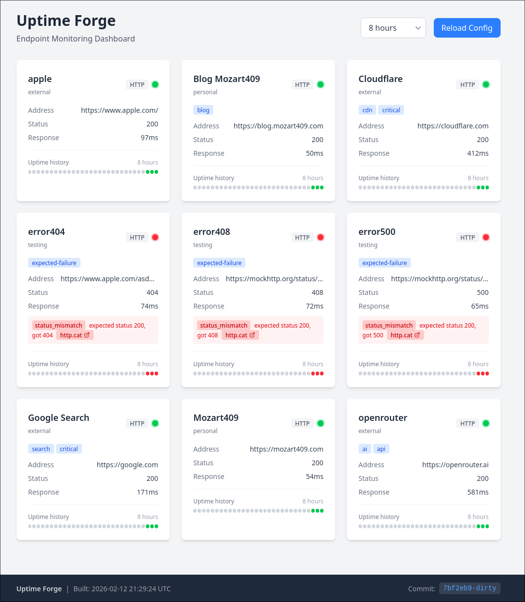

# Uptime Forge

A lightweight uptime monitoring service built with Rust. Monitor HTTP endpoints with a clean dashboard UI that auto-refreshes in real-time.

## Features

- **HTTP Endpoint Monitoring** - Check availability of any HTTP/HTTPS endpoint
- **Configurable Checks** - Set interval, timeout, expected status per endpoint
- **Live Dashboard** - Real-time status updates via htmx (auto-refresh every 10s)
- **Hot Config Reload** - Update endpoints without restarting the server
- **TLS Verification Skip** - Option to skip certificate verification for internal services
- **Minimal Resource Usage** - Built with Rust for low memory footprint

## Dashboard



## Quick Start

### Using Docker (Recommended)

```bash
# Copy the example folder
cp -r example/ ~/uptime-forge
cd ~/uptime-forge

# Edit the configuration with your endpoints
vim forge.toml

# Start the stack
docker compose up -d
```

Open http://localhost:3000 to view the dashboard.

The `example/` folder contains everything you need:

- `compose.yml` - Docker Compose configuration
- `forge.toml` - Endpoint configuration (edit this!)
- `postgres/` - PostgreSQL + TimescaleDB configuration

### Using Nix

```bash
nix develop
just css-build
cargo run
```

## Configuration

Create a `forge.toml` file:

```toml
[server]
addr = "127.0.0.1:3000"
reload_config_interval = 60  # Reload config every 60 seconds (0 to disable)

[endpoints.google]
addr = "https://google.com"
description = "Google Search"
interval = 60                    # Check every 60 seconds (default)
timeout = 10                     # 10 second timeout (default)
expected_status = 200            # Expected HTTP status (default)
skip_tls_verification = false    # Skip TLS cert verification (default)

[endpoints.internal-api]
addr = "https://internal.example.com/health"
description = "Internal API"
skip_tls_verification = true     # For self-signed certs
```

### Configuration Options

#### Server

| Option                   | Default  | Description                                   |
| ------------------------ | -------- | --------------------------------------------- |
| `addr`                   | Required | Server bind address (e.g., `127.0.0.1:3000`)  |
| `reload_config_interval` | `60`     | Seconds between config reloads (0 to disable) |

#### Endpoints

| Option                  | Default  | Description                       |
| ----------------------- | -------- | --------------------------------- |
| `addr`                  | Required | URL to monitor                    |
| `description`           | None     | Display name in dashboard         |
| `interval`              | `60`     | Seconds between checks            |
| `timeout`               | `10`     | Request timeout in seconds        |
| `expected_status`       | `200`    | Expected HTTP status code         |
| `skip_tls_verification` | `false`  | Skip TLS certificate verification |

## Database (Postgres + TimescaleDB)

The compose file includes a TimescaleDB-backed Postgres instance with tuning for time-series data.

Default connection string:

```
postgres://uptime:uptime@db:5432/uptime_forge
```

Configuration files (in `example/postgres/`):

- `postgresql.conf` - PostgreSQL tuning settings
- `initdb/001-timescaledb.sql` - Extension initialization

## API Endpoints

| Endpoint  | Method | Description                    |
| --------- | ------ | ------------------------------ |
| `/`       | GET    | Dashboard UI                   |
| `/status` | GET    | Status grid partial (for htmx) |
| `/reload` | GET    | Trigger config reload          |
| `/health` | GET    | Health check (returns "ok")    |

## Development

### Prerequisites

- [Nix](https://nixos.org/download.html) (recommended) or Rust 1.84+
- [Just](https://github.com/casey/just) command runner

### Commands

```bash
# Enter development environment
nix develop

# Run with auto-reload
bacon run-long

# Watch CSS changes
just css-watch

# Build for production
cargo build --release
just css-build

# Run tests
cargo test

# Lint
cargo clippy

# Docker
just docker-up    # Build and start
just docker-down  # Stop
```

### Project Structure

```
uptime-forge/
├── src/
│   ├── main.rs        # Entry point, routing, middleware
│   ├── config.rs      # Configuration structs and loading
│   ├── checker.rs     # Endpoint health checking logic
│   ├── layout.rs      # Maud HTML templates
│   └── public/        # Static assets (css/, js/, favicon)
├── example/           # Ready-to-use deployment files
│   ├── compose.yml    # Docker Compose setup
│   ├── forge.toml     # Example configuration
│   └── postgres/      # PostgreSQL + TimescaleDB config
├── Dockerfile         # Multi-stage Docker build
└── justfile           # Build commands
```

## Tech Stack

- **[Rust](https://www.rust-lang.org/)** - Systems programming language
- **[Axum](https://github.com/tokio-rs/axum)** - Web framework
- **[Maud](https://maud.lambda.xyz/)** - Compile-time HTML templates
- **[htmx](https://htmx.org/)** - Frontend interactivity
- **[Tailwind CSS](https://tailwindcss.com/)** - Styling
- **[Reqwest](https://github.com/seanmonstar/reqwest)** - HTTP client
- **[SQLx](https://github.com/launchbadge/sqlx)** - Async SQL toolkit
- **[Postgres](https://www.postgresql.org/)** - Database
- **[TimescaleDB](https://www.timescale.com/)** - Time-series extensions

## License

MIT
